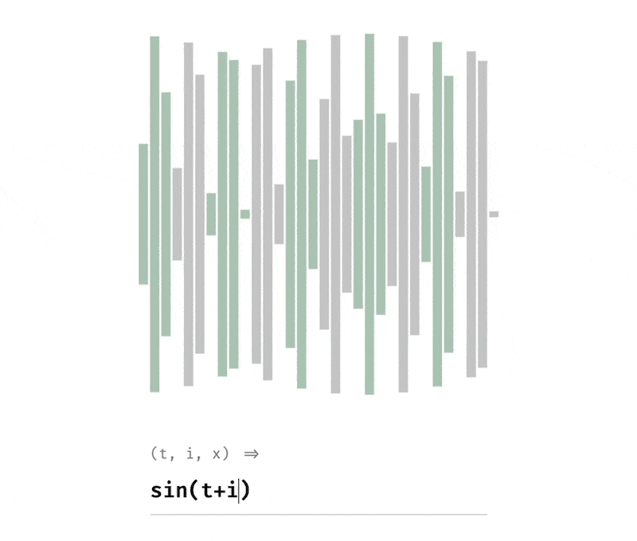
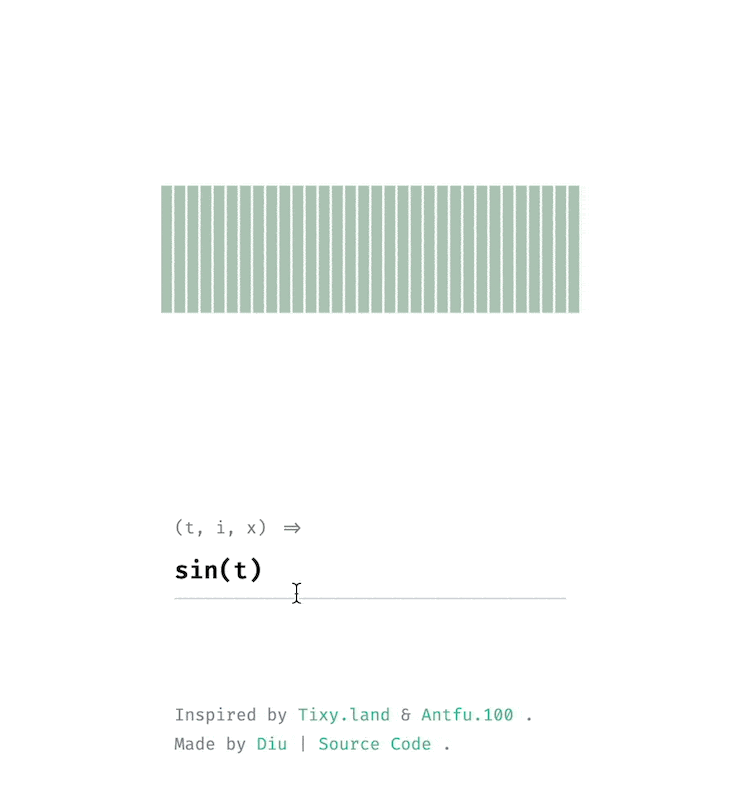
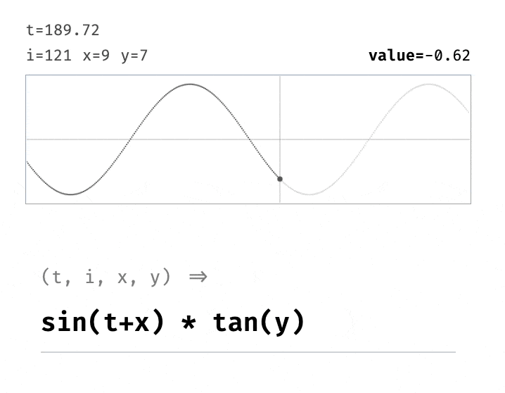

# Tin

<picture>
  <source media="(prefers-color-scheme: dark)" srcset="./screenshots/tin-dark.gif" >
  <source media="(prefers-color-scheme: light)" srcset="./screenshots/tin-light.gif">
  
</picture>

Mathematical arts driven by t, i and anything.

The value of each point can be calculated by the following params:

- `t`: time elapsed.
- `i`: index of the point (left to right, top to bottom), starting from 0.
- `x, y, z`: coordinate values of the point in the coordinate system.

Just enter your function expression in the field, and each point will then represet the value of the calculation: 

- **value > 0**: displayed in color, and the size of the dot **increases** as the value **increases**, the maximum value is `1`.
- **value < 0**: displayed in gray, and the size of the dot **increases** as the value **decreases**, the minimum value is `-1`.

## Canvas

Select the canvas from the drop-down menu. 1D, 2D and 3D are available.

<picture>
  <source media="(prefers-color-scheme: dark)" srcset="./screenshots/canvas-dark.gif" >
  <source media="(prefers-color-scheme: light)" srcset="./screenshots/canvas-light.gif">
  
</picture>

## Spy Mode

<picture>
  <source media="(prefers-color-scheme: dark)" srcset="./screenshots/spy_mode-dark.gif" >
  <source media="(prefers-color-scheme: light)" srcset="./screenshots/spy_mode-light.gif">
  
</picture>

You can select the points you want to see in the spy mode. View an image of the value of the selected points over time.

# Credits

Highly inspired by [Tixy.land](https://tixy.land) and [Antfu.100](https://100.antfu.me/005).

# License

MIT
